# 01. Visión del Proyecto — Zentrix

## 1. Descripción General

**Zentrix** es una plataforma web moderna de **Mobile Device Management (MDM)**, construida bajo una arquitectura **SaaS (Software as a Service)** multi-tenant, que permite a múltiples empresas administrar de forma centralizada su flota de dispositivos **Android** desde una única consola web.

La plataforma cubre el ciclo completo de vida del dispositivo empresarial: **registro (enrollment)**, **monitoreo en tiempo real**, **administración de políticas de seguridad**, **distribución de aplicaciones** y **control remoto**, todo desde un panel centralizado accesible vía navegador.

El sistema se diseña bajo principios de **modularidad**, **escalabilidad** y **seguridad**, de forma que cada dominio funcional (empresas, usuarios, dispositivos, políticas, aplicaciones, monitoreo, reportes, configuración) pueda evolucionar y agregar nuevas funcionalidades sin afectar al resto del sistema.

## 2. Objetivos

### 2.1 Objetivo General

Desarrollar una plataforma SaaS de MDM que permita a organizaciones administrar, proteger y monitorear de forma centralizada sus dispositivos Android corporativos, reduciendo el riesgo operativo y de seguridad asociado a la movilidad empresarial.

### 2.2 Objetivos Específicos

- Permitir el **registro y aprovisionamiento** de dispositivos Android (enrollment) de forma masiva o individual.
- Ofrecer una arquitectura **multi-empresa (multi-tenant)**, aislando datos y configuraciones entre organizaciones.
- Implementar un sistema de **usuarios, roles y permisos** granular, con auditoría de acciones.
- Permitir la creación y asignación de **perfiles y políticas de seguridad** (WiFi, VPN, modo kiosco, restricciones).
- Habilitar la **distribución, actualización y desinstalación remota de aplicaciones (APK)**.
- Proveer **monitoreo en tiempo real** del estado de los dispositivos: ubicación, batería, almacenamiento, memoria y conectividad.
- Generar **alertas** ante eventos críticos (batería baja, pérdida de conexión, incumplimiento de políticas, etc.).
- Ofrecer **reportes exportables** (PDF/Excel) de inventario y eventos.
- Exponer una **API** para integraciones externas y automatización.
- Garantizar la **seguridad** del sistema mediante autenticación robusta, control de acceso y registro de logs.

## 3. Alcance del Proyecto

### 3.1 Dentro del alcance (In Scope)

- Consola web de administración (panel SaaS).
- Backend/API central con soporte multi-tenant.
- Agente/DPC (Device Policy Controller) para dispositivos Android.
- Módulo de administración de empresas (clientes del SaaS).
- Módulo de administración de usuarios, roles y permisos.
- Módulo de gestión de dispositivos (inventario, estado, agrupación, historial).
- Módulo de perfiles y políticas (WiFi, VPN, kiosco, restricciones).
- Módulo de gestión de aplicaciones (subida, instalación, actualización, desinstalación, versionado).
- Módulo de monitoreo (ubicación, batería, almacenamiento, memoria, alertas, última conexión).
- Módulo de reportes (inventario, eventos, exportación PDF/Excel).
- Módulo de configuración del sistema (roles, seguridad, API, logs, integraciones).

### 3.2 Fuera del alcance (Out of Scope) — fase inicial

- Soporte para dispositivos **iOS** (evaluado en fases futuras).
- Aplicación móvil nativa de administración (solo consola web en esta fase).
- Facturación/billing automatizado del SaaS (se define en un módulo posterior).
- Integraciones específicas con terceros (ERP, SSO corporativo) más allá de una API genérica.

## 4. Usuarios del Sistema

| Rol | Descripción |
|---|---|
| **Super Administrador** | Gestiona la plataforma SaaS a nivel global: empresas, configuración del sistema, seguridad e integraciones. |
| **Administrador de Empresa** | Gestiona usuarios, dispositivos, políticas y aplicaciones dentro de su propia organización (tenant). |
| **Operador / Soporte** | Usuario con permisos acotados para monitoreo, soporte y ejecución de acciones remotas puntuales. |
| **Auditor** | Acceso de solo lectura a reportes, logs y auditoría. |

## 5. Flujo Funcional General

El siguiente diagrama describe la navegación y los módulos principales de la plataforma, desde el login hasta cada submódulo funcional:

```mermaid
flowchart TD
A[Inicio] --> B[Login]
B --> C{Autenticación}
C -->|Correcta| D[Dashboard]
C -->|Incorrecta| B
D --> E[Administración de Empresas]
D --> F[Administración de Usuarios]
D --> G[Gestión de Dispositivos]
D --> H[Perfiles y Políticas]
D --> I[Aplicaciones]
D --> J[Monitoreo]
D --> K[Reportes]
D --> L[Configuración]
%% Empresas
E --> E1[Crear Empresa]
E --> E2[Editar Empresa]
E --> E3[Eliminar Empresa]
%% Usuarios
F --> F1[Crear Usuario]
F --> F2[Asignar Roles]
F --> F3[Permisos]
F --> F4[Auditoría]
%% Dispositivos
G --> G1[Registrar Dispositivo]
G --> G2[Inventario]
G --> G3[Estado Online]
G --> G4[Agrupar Equipos]
G --> G5[Historial]
%% Políticas
H --> H1[Crear Perfil]
H --> H2[Configurar WiFi]
H --> H3[VPN]
H --> H4[Modo Kiosco]
H --> H5[Restricciones]
H --> H6[Asignar Perfil]
%% Aplicaciones
I --> I1[Subir APK]
I --> I2[Instalar]
I --> I3[Actualizar]
I --> I4[Desinstalar]
I --> I5[Versiones]
%% Monitoreo
J --> J1[Ubicación]
J --> J2[Batería]
J --> J3[Almacenamiento]
J --> J4[Memoria]
J --> J5[Alertas]
J --> J6[Última Conexión]
%% Reportes
K --> K1[Inventario]
K --> K2[Eventos]
K --> K3[Exportar PDF]
K --> K4[Exportar Excel]
%% Configuración
L --> L1[Roles]
L --> L2[Seguridad]
L --> L3[API]
L --> L4[Logs]
L --> L5[Integraciones]
```

## 6. Criterios de Éxito

- Una empresa puede registrarse en la plataforma, dar de alta usuarios y comenzar a administrar dispositivos sin intervención manual del proveedor.
- Un dispositivo Android puede ser inscrito y reflejar su estado (online, batería, ubicación) en la consola en menos de 1 minuto desde el enrollment.
- Las políticas y aplicaciones asignadas a un perfil se propagan a todos los dispositivos del grupo correspondiente sin afectar a otros tenants.
- El sistema mantiene aislamiento total de datos entre empresas (multi-tenancy seguro).
- Toda acción administrativa relevante queda registrada en el módulo de auditoría/logs.

## 7. Próximos Documentos

Este documento es el primero de la serie de documentación funcional/técnica del proyecto. Los siguientes documentos profundizarán en:

- `02_Arquitectura_del_Sistema.md` — arquitectura técnica, stack tecnológico y diagrama de componentes.
- `03_Modelo_de_Datos.md` — entidades, relaciones y modelo multi-tenant.
- `04_Especificación_de_Módulos.md` — detalle funcional de cada módulo (Empresas, Usuarios, Dispositivos, Políticas, Aplicaciones, Monitoreo, Reportes, Configuración).
- `05_Seguridad_y_Cumplimiento.md` — autenticación, autorización, cifrado y buenas prácticas.
