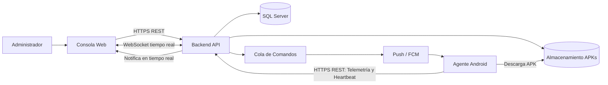

# 02. Arquitectura del Sistema — Zentrix

## 1. Visión General

Zentrix se organiza en cuatro capas que se comunican entre sí mediante contratos bien definidos (REST, WebSocket y notificaciones push), permitiendo que cada capa evolucione de forma independiente:

1. **Consola Web (Frontend)** — React + TypeScript + Next.js.
2. **Backend API** — Spring Boot (Java) + SQL Server, multi-tenant.
3. **Canal de comandos y notificaciones** — Cola de mensajes + servicio Push (FCM).
4. **Agente Android (Device Agent / DPC)** — ejecuta políticas y reporta telemetría.

## 2. Diagrama de Componentes

## 3. Descripción de Componentes

| Componente | Tecnología | Responsabilidad |
|---|---|---|
| **Consola Web** | React + TypeScript + Next.js | Interfaz de administración; consume la API REST y se suscribe al WebSocket para estado en tiempo real. |
| **Backend API** | Spring Boot (Java) | Lógica de negocio, autenticación/autorización, orquestación de módulos, aislamiento multi-tenant. |
| **SQL Server** | Microsoft SQL Server | Persistencia principal: empresas, usuarios, dispositivos, políticas, eventos, auditoría. |
| **Almacenamiento de APKs** | Object storage (ej. S3-compatible) | Repositorio de los archivos APK subidos para distribución a dispositivos. |
| **Cola de Comandos** | Message broker (ej. RabbitMQ/Kafka) | Desacopla la emisión de comandos (instalar app, aplicar política, bloquear equipo) de su entrega al dispositivo. |
| **Servicio Push (FCM)** | Firebase Cloud Messaging | Despierta al agente Android para que consulte comandos pendientes, incluso si la app está en background. |
| **Agente Android (Device Agent)** | Kotlin, rol *Device Owner* | Aplica políticas, instala/actualiza apps, reporta telemetría (batería, ubicación, almacenamiento) y ejecuta comandos remotos. |

## 4. Flujos de Comunicación

### 4.1 Flujo síncrono (Administrador → API)
El administrador interactúa con la Consola Web, que llama a la API vía HTTPS/REST para operaciones CRUD (empresas, usuarios, dispositivos, políticas, aplicaciones, reportes).

### 4.2 Flujo de comando hacia el dispositivo (asíncrono)
1. El administrador ejecuta una acción (ej. "instalar app" o "aplicar perfil").
2. La API valida, persiste el comando y lo publica en la **Cola de Comandos**.
3. Un worker consume la cola y envía una notificación **Push (FCM)** al dispositivo objetivo.
4. El **Agente Android** recibe el push, se conecta a la API, obtiene el comando pendiente y lo ejecuta (aplica política, descarga APK desde el almacenamiento, etc.).
5. El agente reporta el resultado a la API (éxito/error).

### 4.3 Flujo de telemetría y estado (dispositivo → API → dashboard)
1. El **Agente Android** envía periódicamente (heartbeat) su estado: batería, ubicación, almacenamiento, memoria, conectividad.
2. La API persiste el estado en SQL Server y evalúa reglas de alerta (ej. batería baja, incumplimiento de política).
3. La API notifica el cambio en tiempo real a la Consola Web vía **WebSocket**, actualizando el dashboard sin necesidad de recargar.

## 5. Multi-tenancy

- Cada registro de negocio (usuario, dispositivo, política, aplicación, evento) pertenece a una **Empresa (tenant)**, identificada por `company_id`.
- El aislamiento de datos se aplica a nivel de la capa de acceso a datos del backend: toda consulta se filtra automáticamente por el tenant del usuario autenticado.
- Los roles **Super Administrador** operan a nivel de plataforma (cross-tenant); el resto de roles quedan acotados a su propia empresa.

## 6. Seguridad de las Comunicaciones

- Toda comunicación Consola↔API y Dispositivo↔API se realiza sobre **HTTPS**.
- La autenticación de la Consola Web usa **JWT**; el Agente Android se autentica con credenciales/token de dispositivo emitidas durante el enrollment.
- La Cola de Comandos y el canal Push no exponen datos sensibles del tenant; solo transportan identificadores de comando que el dispositivo resuelve contra la API autenticada.

## 7. Próximo Documento

- `03_Modelo_de_Datos.md` — entidades, relaciones y estrategia de aislamiento multi-tenant a nivel de base de datos.
