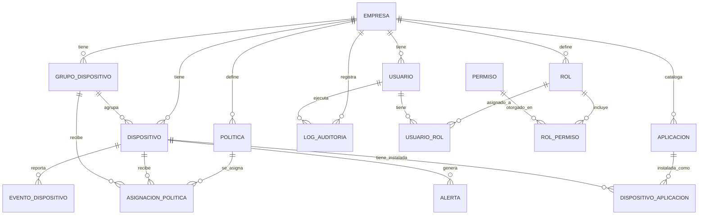

# 03. Modelo de Datos — Zentrix

## 1. Motor de Base de Datos

**Microsoft SQL Server**, accedido desde el backend (Spring Boot) vía JPA/Hibernate. Las migraciones versionadas (Flyway) crean y evolucionan el esquema.

## 2. Estrategia Multi-Tenant

Se usa el modelo **base de datos compartida, esquema compartido**, con una columna `EmpresaId` (tenant discriminator) en cada tabla de negocio. Es el enfoque más simple de operar y el más económico en infraestructura para un SaaS con muchas empresas pequeñas/medianas.

Aislamiento en dos capas (defensa en profundidad):

1. **Capa de aplicación**: todo repositorio del backend filtra automáticamente por el `EmpresaId` del usuario autenticado (vía un filtro/interceptor común en `common/`), de modo que ninguna consulta puede cruzar tenants por error.
2. **Capa de base de datos**: se define **Row-Level Security (RLS)** en SQL Server sobre las tablas sensibles, usando `SESSION_CONTEXT('EmpresaId')` seteado al abrir la conexión. Así, aunque una consulta mal escrita omita el filtro, SQL Server igual restringe las filas visibles.

El rol **Super Administrador** opera fuera de este filtro (acceso cross-tenant), controlado explícitamente a nivel de aplicación.

## 3. Diagrama Entidad-Relación

## 4. Diccionario de Entidades

### 4.1 EMPRESA
Tenant de la plataforma (cliente del SaaS).

| Campo | Tipo (SQL Server) | Notas |
|---|---|---|
| EmpresaId | INT IDENTITY, PK | |
| Nombre | NVARCHAR(150) | |
| RUC_NIT | NVARCHAR(50) | Identificador fiscal, único |
| Estado | NVARCHAR(20) | Activa, Suspendida, Eliminada |
| FechaCreacion | DATETIME2 | |

### 4.2 USUARIO
Usuario del panel, pertenece a una Empresa (excepto Super Administrador).

| Campo | Tipo | Notas |
|---|---|---|
| UsuarioId | INT IDENTITY, PK | |
| EmpresaId | INT, FK → EMPRESA | Nullable solo para Super Administrador |
| Nombre | NVARCHAR(150) | |
| Email | NVARCHAR(200) | Único |
| PasswordHash | NVARCHAR(255) | Hash (BCrypt) |
| Estado | NVARCHAR(20) | Activo, Inactivo |
| FechaCreacion | DATETIME2 | |

### 4.3 ROL / PERMISO / USUARIO_ROL / ROL_PERMISO
Modelo RBAC estándar. `ROL` pertenece a una Empresa (permite roles personalizados por cliente); `PERMISO` es catálogo global de la plataforma (fijo por código, ej. `DEVICE_WIPE`, `POLICY_ASSIGN`).

| Tabla | Campos clave |
|---|---|
| ROL | RolId PK, EmpresaId FK, Nombre |
| PERMISO | PermisoId PK, Codigo (único), Descripcion |
| USUARIO_ROL | UsuarioId FK, RolId FK (PK compuesta) |
| ROL_PERMISO | RolId FK, PermisoId FK (PK compuesta) |

### 4.4 DISPOSITIVO
Dispositivo Android inscrito.

| Campo | Tipo | Notas |
|---|---|---|
| DispositivoId | INT IDENTITY, PK | |
| EmpresaId | INT, FK → EMPRESA | |
| GrupoDispositivoId | INT, FK → GRUPO_DISPOSITIVO | Nullable |
| IMEI | NVARCHAR(50) | Único |
| NumeroSerie | NVARCHAR(100) | |
| Modelo | NVARCHAR(100) | |
| VersionAndroid | NVARCHAR(20) | |
| TokenEnrollment | NVARCHAR(255) | Credencial de autenticación del agente |
| Estado | NVARCHAR(20) | Online, Offline, Bloqueado, Eliminado |
| UltimaConexion | DATETIME2 | |
| FechaRegistro | DATETIME2 | |

### 4.5 GRUPO_DISPOSITIVO
Agrupación lógica de equipos (ej. "Ventas", "Almacén") para asignar políticas/apps en bloque.

| Campo | Tipo | Notas |
|---|---|---|
| GrupoDispositivoId | INT IDENTITY, PK | |
| EmpresaId | INT, FK → EMPRESA | |
| Nombre | NVARCHAR(150) | |

### 4.6 POLITICA (Perfil)
Perfil de configuración: WiFi, VPN, modo kiosco, restricciones.

| Campo | Tipo | Notas |
|---|---|---|
| PoliticaId | INT IDENTITY, PK | |
| EmpresaId | INT, FK → EMPRESA | |
| Nombre | NVARCHAR(150) | |
| Tipo | NVARCHAR(30) | WIFI, VPN, KIOSCO, RESTRICCIONES |
| ConfiguracionJson | NVARCHAR(MAX) | Parámetros específicos del tipo (JSON) |
| FechaActualizacion | DATETIME2 | |

### 4.7 ASIGNACION_POLITICA
Asocia una política a un Dispositivo o a un Grupo de dispositivos (uno de los dos, no ambos).

| Campo | Tipo | Notas |
|---|---|---|
| AsignacionPoliticaId | INT IDENTITY, PK | |
| PoliticaId | INT, FK → POLITICA | |
| DispositivoId | INT, FK → DISPOSITIVO | Nullable |
| GrupoDispositivoId | INT, FK → GRUPO_DISPOSITIVO | Nullable |
| FechaAsignacion | DATETIME2 | |

### 4.8 APLICACION
Catálogo de APKs disponibles para distribución.

| Campo | Tipo | Notas |
|---|---|---|
| AplicacionId | INT IDENTITY, PK | |
| EmpresaId | INT, FK → EMPRESA | |
| Nombre | NVARCHAR(150) | |
| PackageName | NVARCHAR(150) | Identificador del paquete Android |
| VersionActual | NVARCHAR(30) | |
| UrlArchivo | NVARCHAR(500) | Referencia al almacenamiento de APKs |
| FechaSubida | DATETIME2 | |

### 4.9 DISPOSITIVO_APLICACION
Estado de instalación de una app en un dispositivo concreto.

| Campo | Tipo | Notas |
|---|---|---|
| DispositivoAplicacionId | INT IDENTITY, PK | |
| DispositivoId | INT, FK → DISPOSITIVO | |
| AplicacionId | INT, FK → APLICACION | |
| VersionInstalada | NVARCHAR(30) | |
| Estado | NVARCHAR(20) | Pendiente, Instalada, Error, Desinstalada |
| FechaActualizacion | DATETIME2 | |

### 4.10 EVENTO_DISPOSITIVO
Telemetría histórica reportada por el agente (ubicación, batería, almacenamiento, memoria).

| Campo | Tipo | Notas |
|---|---|---|
| EventoDispositivoId | BIGINT IDENTITY, PK | |
| DispositivoId | INT, FK → DISPOSITIVO | |
| Tipo | NVARCHAR(30) | UBICACION, BATERIA, ALMACENAMIENTO, MEMORIA, CONEXION |
| ValorJson | NVARCHAR(MAX) | Payload específico del tipo |
| FechaEvento | DATETIME2 | Indexado, usado para el módulo de Historial |

### 4.11 ALERTA
Alertas generadas a partir de eventos (batería baja, incumplimiento de política, pérdida de conexión).

| Campo | Tipo | Notas |
|---|---|---|
| AlertaId | INT IDENTITY, PK | |
| DispositivoId | INT, FK → DISPOSITIVO | |
| Tipo | NVARCHAR(30) | |
| Severidad | NVARCHAR(20) | Baja, Media, Alta, Crítica |
| Mensaje | NVARCHAR(500) | |
| Atendida | BIT | |
| FechaCreacion | DATETIME2 | |

### 4.12 LOG_AUDITORIA
Registro de acciones administrativas relevantes (módulo Auditoría / Configuración → Logs).

| Campo | Tipo | Notas |
|---|---|---|
| LogAuditoriaId | BIGINT IDENTITY, PK | |
| EmpresaId | INT, FK → EMPRESA | |
| UsuarioId | INT, FK → USUARIO | |
| Accion | NVARCHAR(100) | Ej. "CREAR_USUARIO", "ASIGNAR_POLITICA" |
| DetalleJson | NVARCHAR(MAX) | |
| FechaAccion | DATETIME2 | |

## 5. Índices Recomendados

- `DISPOSITIVO(EmpresaId, Estado)` — listados de inventario filtrados por estado.
- `EVENTO_DISPOSITIVO(DispositivoId, FechaEvento DESC)` — consulta de historial reciente por equipo.
- `ALERTA(EmpresaId, Atendida)` — panel de alertas pendientes.
- `LOG_AUDITORIA(EmpresaId, FechaAccion DESC)` — auditoría paginada por fecha.

## 6. Próximo Documento

- `04_Especificación_de_Módulos.md` — detalle funcional y reglas de negocio de cada módulo (Empresas, Usuarios, Dispositivos, Políticas, Aplicaciones, Monitoreo, Reportes, Configuración).
